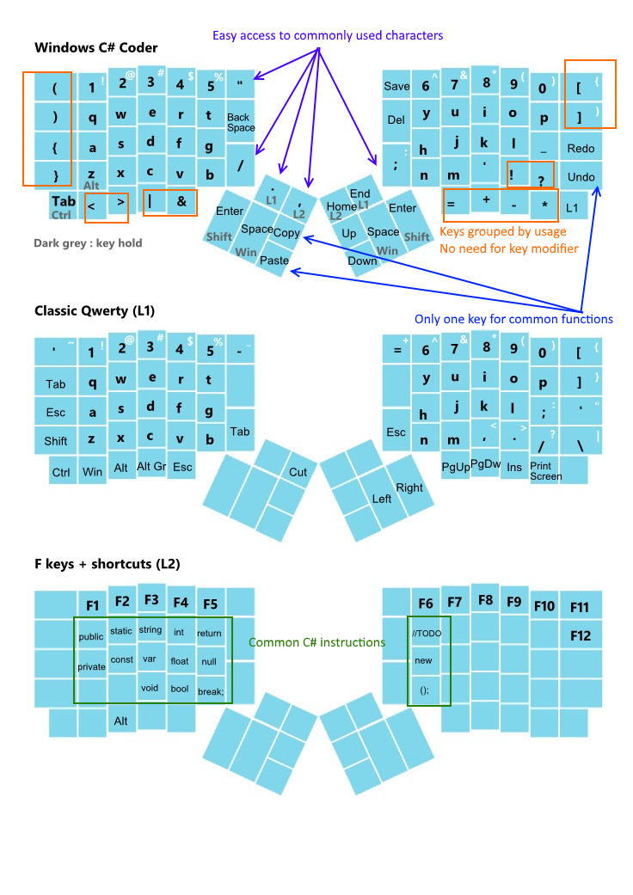

# ErgoDox EZ C# Developer configuration

## Changelog

* Feb 12, 2016 (V1): 
  * First version commit

## About
This layout was conceived in an attempt to optimise keyboard layout for developers (C# more specifically, but it can work with most of other languages), and limit the keys required to perform the most frequent actions.

I came to the realization that my main tool as a developer, the qwerty keyboard was something that did not evolved at its core in almost 150 years.
There are a lot of reasons to this, and it would be a massive entreprise to change a standard so strongly anchored, but I wanted to give it a try and see how would look an input device dedicated to developers, more specifically a C# developer in my case.
The biggest flaw in standard QWERTY keyboards was that I always needed to perform key combination to access commonly used characters or actions. Think about it a minute, how many times a day do you press a modifier key such as Ctrl or Shift, it's insane and could be so easily optimized to require only one key press.

Then I came across the ErgoDox EZ project, that allowed a full customization of its firmware, and a unique 2 parts design.

## Layout design principles
-No key combination required for the most common input characters ( (),[],{},<> ... )
-No key combination required for the most common actions (copy/paste/undo/save)
-Regroup characters by usage ( + - * =  ...)
-Easy access to the most commonly used characters: ; / " . ,
-Preregistered macro for the most common C# langage instructions: public / private / string / int / float ...

## Why is it specific to C#
I defined the characters priority based on their usage in C# language, most of this characters are also used in other coding languages but it may require some tweaking. 
For example there is no direct access to ~ or $ keys which can be very common in some languages.
Note it is also specific to Windows environement as the shortcut used in action keys would not work on Mac Os

## In usage
It was relatively easy to get used to the layout, but it's hard for me to define how easy it was as I was getting used to a blank Ergodox keyboard at the same time.
Still it's extremely satisfying to Save your file with just one easily accessible key or to have one big key to end your code line ( ; )

## Improvements
This layout was shared after a bunch of iterations and only once I was happy with it.
Still there are many way to improve or iterate on this:
-Make it language agnostic
-Check and compile language's keyboard's heatmaps to statistically define keys priority (e.g.  https://dzone.com/articles/most-pressed-keys-various )
-QWERTY is still not the most efficient typing layout, I would like to create a Dvorak based similar layout in a near futur
-Layout 1 is mainly here for safety, most of its unique keys could be transfered to Layout 2 and it could then be removed

## Issues 
One of the issues encountered while creating this layout was that I did not find a way to have a key to send a modifier on hold, and a key combination while pressed (e.g. I can't set a Key to do Save (Ctrl + S) when pressed and Shift modifier when hold )

